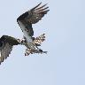
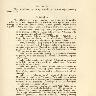

Generate Centered Thumbnails In Java
====================================
There are many thumbnail libraries out there but if you need a simple thumbnail generator for Java without any external dependencies you can use this `ImageUtil` class.

```java
import java.awt.Color;
import java.awt.Graphics2D;
import java.awt.Image;
import java.awt.RenderingHints;
import java.awt.image.BufferedImage;
import java.io.IOException;

public class ImageUtil {

	/**
	 * Builds a @{code BufferedImage} of an {@code Image}
	 * 
	 * @see java.awt.image.BufferedImage
	 * @see java.awt.Image
	 * 
	 * @param image
	 * @return BufferedImage
	 */
	public static BufferedImage buildBufferedImage(Image image) {
		BufferedImage result = new BufferedImage(image.getWidth(null), image.getHeight(null), BufferedImage.TYPE_INT_RGB);
	    Graphics2D graphics = result.createGraphics();
	    graphics.drawImage(image, 0, 0, null);
	    graphics.dispose();
	    return result;
	}

	/**
	 * Obtains an image resulted from cropping the center of the given {@code image} with the desired {@code width} and {@code height} 
	 *  
	 * @param image
	 * @param width
	 * @param height
	 * @return Image
	 */
	public static Image obtainCenterCrop(Image image, final int width, final int height) {
		int imageWidth = image.getWidth(null);
		int imageHeight = image.getHeight(null);
		int x = (int) (imageWidth / 2) - (width / 2);
		int y = (int) (imageHeight / 2) - (height / 2);
		return buildBufferedImage(image).getSubimage(x, y, width, height);
	}

	/**
	 * <p>Obtains a proportionally resized image where its shortest edge is resized to match {@code shortEdgeLength}.</p>
	 * <p>Examples:<p>
	 * <ul>
	 * 	<li>an input image with width=100 and height=50 and shortEdgeLength=25 results in a image with width=50 and height=25</li>
	 * 	<li>an input image with width=50 and height=100 and shortEdgeLength=25 results in a image with width=25 and height=100</li>
	 * </ul>
	 * 
	 * @param image: the reference image
	 * @param shortEdgeLength: the target value of the resulting image's short edge
	 * @return Image
	 */
	public static Image obtainShortEdgeResizedImage(final Image image, final int shortEdgeLength) {
		int imageWidth = image.getWidth(null);
		int imageHeight = image.getHeight(null);
		double shortEdgeRatio;
		int thumbnailHeight;
		int thumbnailWidth;

		boolean isLandscape = (imageWidth >= imageHeight);
		if (isLandscape) {
			shortEdgeRatio = (double) imageHeight / (double) shortEdgeLength;
			thumbnailWidth = (int) (imageWidth / shortEdgeRatio);
			thumbnailHeight = shortEdgeLength;
		} else {
			shortEdgeRatio = (double) imageWidth / (double) shortEdgeLength;
			thumbnailHeight = (int) (imageHeight / shortEdgeRatio);
			thumbnailWidth = shortEdgeLength;			
		}
		
		BufferedImage result = new BufferedImage(thumbnailWidth, thumbnailHeight, BufferedImage.TYPE_INT_RGB);
		Graphics2D graphics2D = result.createGraphics();
		graphics2D.setBackground(Color.WHITE);
		graphics2D.setPaint(Color.WHITE);
		graphics2D.fillRect(0, 0, thumbnailWidth, thumbnailHeight);
		graphics2D.setRenderingHint(RenderingHints.KEY_INTERPOLATION, RenderingHints.VALUE_INTERPOLATION_BILINEAR);
		graphics2D.drawImage(image, 0, 0, thumbnailWidth, thumbnailHeight, null);
		return result;
	}
}
```

The idea is to resized the image by the short edge and then crop it from the center.

Samples:






Here is the code used to generate the thumbnails above:

```java
List imageUrls = new ArrayList();
imageUrls.add(new URL("https://upload.wikimedia.org/wikipedia/commons/thumb/0/05/Flag_of_Brazil.svg/720px-Flag_of_Brazil.svg.png"));
imageUrls.add(new URL("https://upload.wikimedia.org/wikipedia/commons/c/c2/Knute_Nelson_photograph_Civil_War.jpg"));
imageUrls.add(new URL("https://upload.wikimedia.org/wikipedia/commons/thumb/5/57/TjWikiKatahdin.jpg/800px-TjWikiKatahdin.jpg"));
imageUrls.add(new URL("https://upload.wikimedia.org/wikipedia/commons/thumb/f/f7/Mont_de_Seuc_y_l_Saslong_da_Cod_dal_Fil.jpg/800px-Mont_de_Seuc_y_l_Saslong_da_Cod_dal_Fil.jpg"));
imageUrls.add(new URL("https://upload.wikimedia.org/wikipedia/commons/b/bf/Caught-a-fish.jpg"));
imageUrls.add(new URL("https://upload.wikimedia.org/wikipedia/commons/e/ee/Treaty_of_Riga.jpg"));
imageUrls.add(new URL("https://upload.wikimedia.org/wikipedia/commons/9/9b/Gustav_chocolate.jpg"));
imageUrls.add(new URL("https://upload.wikimedia.org/wikipedia/commons/1/15/Red_Apple.jpg"));
imageUrls.add(new URL("https://upload.wikimedia.org/wikipedia/commons/e/e3/Panthera_tigris6.jpg"));

for (int i=0; i < imageUrls.size(); i++) {
	Image image = ImageIO.read(imageUrls.get(i).openStream());
	Image resizedImage = ImageUtil.obtainShortEdgeResizedImage(image, 96);
	Image croppedImage = ImageUtil.obtainCenterCrop(resizedImage, 96, 96);
	ImageIO.write(ImageUtil.buildBufferedImage(croppedImage), "JPG", new File("target/thumbnail-" + i + ".jpg"));
}
```