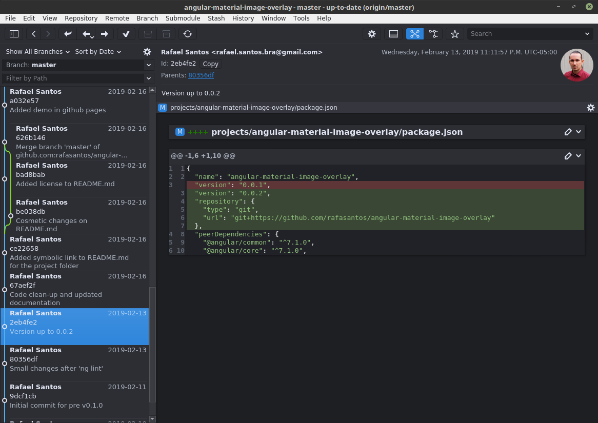

GitAhead
--------


[GitAhead](https://github.com/gitahead/gitahead) is a graphical Git client designed to help you understand and manage your source code history.
It's available for Windows, Linux, and macOS.

#### Linux installation
```
# Go to the directory where you want to install it
cd ~/dev
wget https://github.com/gitahead/gitahead/releases/download/v2.5.3/GitAhead-2.5.3.sh
sh GitAhead
# The desktop shortcut is located at, you may need to restart your x-window
ll ~/.local/share/applications/gitahead.desktop
```


